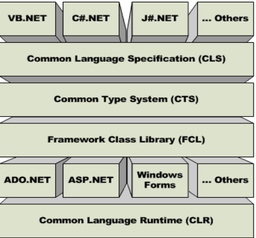

# .NET Framework

## 

  - CLS : subset of CTS.set of rules and restrictions that every language must follow
  - CTS : CTS stands for Common Type System. (Rules)state 
    how a data type should be declared, defined and used in the program
  - FCL/BCL -  Framework Class Library is the collection of classes, namespaces, interfaces and value types that are used for .NET applications
  - CLR :  Common Language Runtime (CLR) manages the execution of programs written in any language. memory management, security checks etc

## Grabage Collection (GC)

- Generation 0 : Short-Lived Objects.GC Runs Most frequent
- Generation 1 : Survivors of Gen 0 promoted to Gen 1.
- Generation 2 : Survivors of Gen 0 promoted to Gen 2. Long Lived Objects. GC Runs least frequent

### Dispose VS Finalize
- Dispose : this method developer has to write the code to clean or destroy the objects which are no more required. Performance not cost associated 
- Finalize : called by GARBAGE COLLECTOR automatically and need not to be called by the user code to run.Performance cost associated 

```C#
public class Demo : IDisposable
{
    private bool disposed = false;

    public void Dispose()
    {
        Dispose(true);
        GC.SuppressFinalize(this);
    }

    protected virtual void Dispose(bool disposing)
    {
        if (!disposed)
        {
            if (disposing)
            {
                // Clean up managed objects
            }

            // Clean up unmanaged objects
            disposed = true;
        }
    }
}

```

### FORCE GARBAGE COLLECTOR
method GC.COLLECT(), not recommended

## Multi Threading
- SYSTEM.THREDING
- Task are WRAPPER around Thread classes
- The async keyword turns a method into an async method, which allows you to use the await keyword in its body.
- Thread.Sleep(500),Task.Run( () => {// Methods})\

## REFLECTION
ability of a code to access the metadata of the assembly during runtime