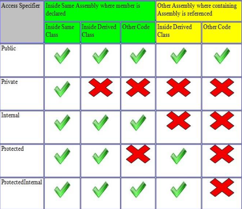

# C# interview Notes

## OOPS
 - inheritance
    - single (A->B)
    - multiple (through interface only) (IA,IB ->c)
    - multilevel (A -> B ->c)
    - Hierarchal (A-> B , A->C)
    - prevent class from inheritance using sealed (sealed class classname)
    - Make constructor private to avoid deriving from the class or to create a new instance of object
 -  Polymorphism
    - complile time (method overloading)
        - number of params
        - type of params
        - order of params
    - Runtime : 
        - Overriding uses VIRTUAL keyword for base class method and OVERRIDE
keyword for derived class method
 - Abstraction: Showing only required.(class.methodName())
 - Encapsulation: WRAPPING of data and methods/properties, access modifiers

 ### Method hiding 
hide the implementation of the methods of a 
base class from the derived class using the new keyword.
```C#
public class BaseClass
{
    public void print()
    {
        Console.WriteLine("Base Class print Method");
    }
}
public class DerivedClass
{
    public new void print()
    {
        Console.WriteLine("Derived Class print Method");
    }
}
```

### Abstraction vs Interface
    - Abstraction : 
        - Abstract class contains both DECLARATION & DEFINITION of methods
        - Abstract class can contain methods, fields, constants, constructor.
    - Interface :
        - Interface contains ONLY DECLARATION of methods.
        - Interface can contain undefined methods only.

### Assembly
An assembly can be an executable (.exe) or a dynamic link library (.dll) file.
- Private Assembly : used by a single application only.
- Shared Assembly : libraries of code, which 
multiple applications will use.  normally stored in the global assembly cache(GAC).
- Satellite Assembly : assembly with resources only, no executable code.(e.g .resx files)


### Access Specifiers
internal is default Access Specifier

| Access Specifier   | Inside Same Class | Inside Derived Class (Same Assembly) | Other Code (Same Assembly) | Inside Derived Class (Different Assembly) | Other Code (Different Assembly) |
|--------------------|-------------------|--------------------------------------|----------------------------|-------------------------------------------|---------------------------------|
| `public`           | ✔️                | ✔️                                   | ✔️                         | ✔️                                        | ✔️                              |
| `private`          | ✔️                | ❌                                   | ❌                         | ❌                                        | ❌                              |
| `internal`         | ✔️                | ✔️                                   | ✔️                         | ❌                                        | ❌                              |
| `protected`        | ✔️                | ✔️                                   | ❌                         | ✔️                                        | ❌                              |
| `protected internal` | ✔️             | ✔️                                   | ✔️                         | ✔️                                        | ❌                              |


### Boxing and Unboxing 
```C#
 class Program
 {
    static void main(string[] args)
    {
        int num = 100;
        object obj = num; //Boxing
        int i = (int)obj; //unboxing
    }
 }
```

### String and String Builder
#### String
- immutable
- Basic Opertaions 
    - Concate = str1 + str2;
    - replace = str1.replace("i","j");
    - trim = str1.trim();
    - contains = str1.contains("test") 
    - Convert.ToString(str1) =  handles null 
    - str1.ToString() = doesn’t handle null
#### String builder 
- mutable

### Generics 
```C#
// Class
public class GenericClass<T>
// Use
GenericClass<int> var1 = new GenericClass<int>();
// Method
public static bool AreEqual<T>(T val1, T val2)
// Use
Calculator.AreEqual<int>(2,2)
```

### Nullables 
To hold the null values we have to use nullable
```C#
Nullable<T> 
T? var1 = null;
```

### Throw vs Throw Ex
- Throw ex will change the stack trace, whereas throw will preserve 
the original stack trace
- Throw is good

### ARRRAY VS ARRAYLIST
- Array is strongly Typed
- ARRAYLIST can store any data type

### System.Collection.Generics
```C#
 Dictionary<TKey,TValue>
 List<T>
 Queue<T>
 Stack<T>
 SortedList<TKey,TValue>
 ```

 ### IEnumberable and IEnumerator
- IEnumerable interface is used when we want to ITERATE among our 
collection classes using a FOREACH loop
- IEnumberable will use IEnumerator internally

### OUT VS REF
- ref and out keywords we can pass parameters by reference
- out does not need to be intialized before passing.

### PARAMS
- can take the VARIABLE NUMBER OF ARGUMENTS.do for each loop in function
```C#
public static int Add(params int[] listnumbers)
```

### constructor 
- Default
- Parameterized
- Copy
- Static : 
    Static constructor is used to be called before any static 
    member of a class.
- Private : 
    - not possible for other classes to derive from this class.
    - it is used in a class 
        that contains only static members.

### Extention Methods
Allows you to add new methods in the existing 
class WITHOUT MODIFYING the source code of the original class
1. Static Class and Static Method: Extension methods must be defined in a static class and the method itself must be static.
2. this Keyword: The first parameter of the extension method specifies which type it operates on, and it must be preceded by the this keyword.
3. Namespace Import: To use extension methods, the namespace containing the static class must be imported.

```C#
using System;

namespace ExtensionMethods
{
    public static class StringExtensions
    {
        // Extension method for the string class
        public static int WordCount(this string str)
        {
            if (string.IsNullOrEmpty(str))
            {
                return 0;
            }

            return str.Split(new char[] { ' ', '.', '?' }, StringSplitOptions.RemoveEmptyEntries).Length;
        }
    }
}

// Main CS file
using System;
using ExtensionMethods; // Import the namespace containing the extension method

class Program
{
    static void Main()
    {
        string sentence = "Hello, world! How are you today?";
        int wordCount = sentence.WordCount(); // Using the extension method
        Console.WriteLine($"Word count: {wordCount}"); // Outputs: Word count: 6
    }
}

```

### Delegate
a variable that holds the REFERENCE TO A METHOD.
- MULTICAST DELEGATES : a delegate that holds the references of more than one function.
- ANONYMOUS DELEGATES : 
```C#
        delegate void printDelegate(string message);
        static void main()
        {
            printDelegate print = delegate(string message)
            {
                Console.WriteLine(message);
            };
            print("Hello World");
        }
```

### IS and AS
-  The IS operator is USED TO CHECK the type of an object.(Boolean)
-  AS operator is used to PERFORM CONVERSION between compatible 
reference type(Non Boolean)

### Extras 
- ReadOnly is a RUNTIME constant and Constant is a COMPILE time constant.
- var type is decided at compile time. dynamic type is decide at runtime.