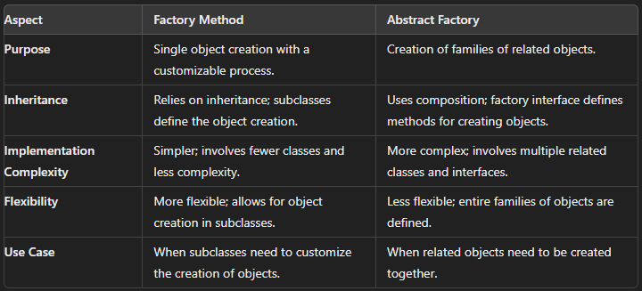

# Factory Design Pattern
The Factory Design Pattern is a creational design pattern that provides a way to create objects without specifying the exact class of the object that will be created. This pattern delegates the responsibility of instantiating objects to a separate factory class, which helps in encapsulating the object creation logic and promoting loose coupling between classes.

## Key Concepts
- **Factory Method**: A method that returns objects of a base type or interface, where the exact type of the object is determined at runtime.
- **Product**: The common interface or abstract class that defines the object structure to be created.
- **Concrete Product**: The specific implementations or subclasses of the Product.
- **Creator/Factory**: The abstract base class or interface that defines the factory method.

## Example

```C#
// Product interface
public interface IProduct
{
    void DisplayInfo();
}

// Concrete Product A
public class ConcreteProductA : IProduct
{
    public void DisplayInfo()
    {
        Console.WriteLine("ConcreteProductA created.");
    }
}

// Concrete Product B
public class ConcreteProductB : IProduct
{
    public void DisplayInfo()
    {
        Console.WriteLine("ConcreteProductB created.");
    }
}

// Creator/Factory class
public class ProductFactory
{
    public IProduct CreateProduct(string productType)
    {
        switch (productType)
        {
            case "A":
                return new ConcreteProductA();
            case "B":
                return new ConcreteProductB();
            default:
                throw new ArgumentException("Invalid product type");
        }
    }
}

// Usage
public class Program
{
    public static void Main(string[] args)
    {
        ProductFactory factory = new ProductFactory();
        
        IProduct productA = factory.CreateProduct("A");
        productA.DisplayInfo(); // Output: ConcreteProductA created.
        
        IProduct productB = factory.CreateProduct("B");
        productB.DisplayInfo(); // Output: ConcreteProductB created.
    }
}

```


| Aspect                      | Factory Method                                    | Abstract Factory                                           |
|-----------------------------|---------------------------------------------------|-------------------------------------------------------------|
| **Purpose**                 | Single object creation with a customizable process.| Creation of families of related objects.                    |
| **Inheritance**             | Relies on inheritance; subclasses define the object creation. | Uses composition; factory interface defines methods for creating objects.|
| **Implementation Complexity**| Simpler; involves fewer classes and less complexity.| More complex; involves multiple related classes and interfaces.|
| **Flexibility**             | More flexible; allows for object creation in subclasses. | Less flexible; entire families of objects are defined.      |
| **Use Case**                | When subclasses need to customize the creation of objects. | When related objects need to be created together.           |

